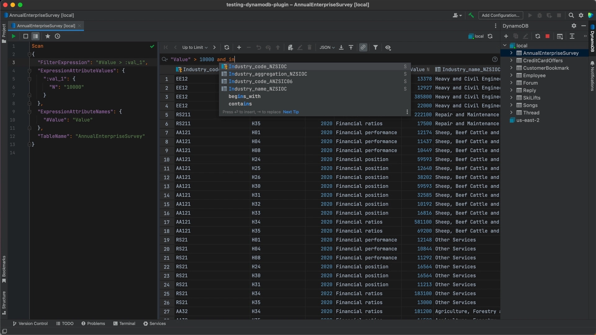
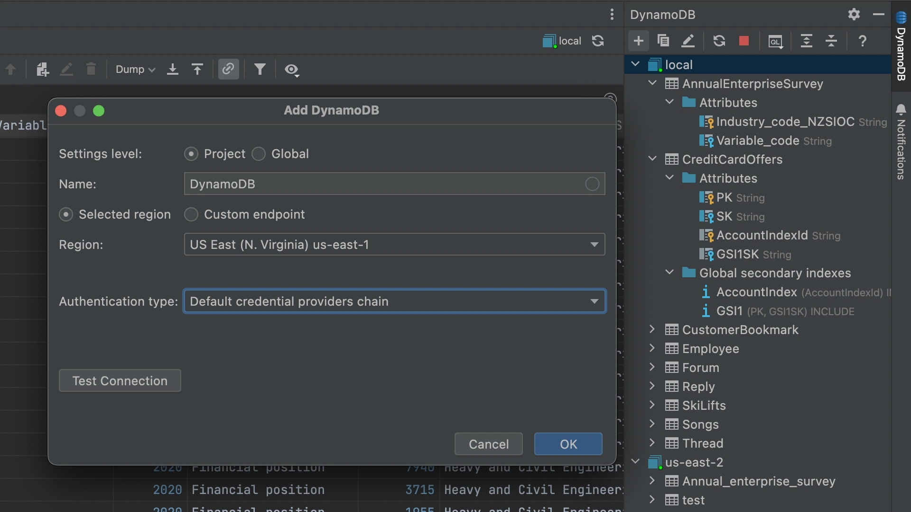
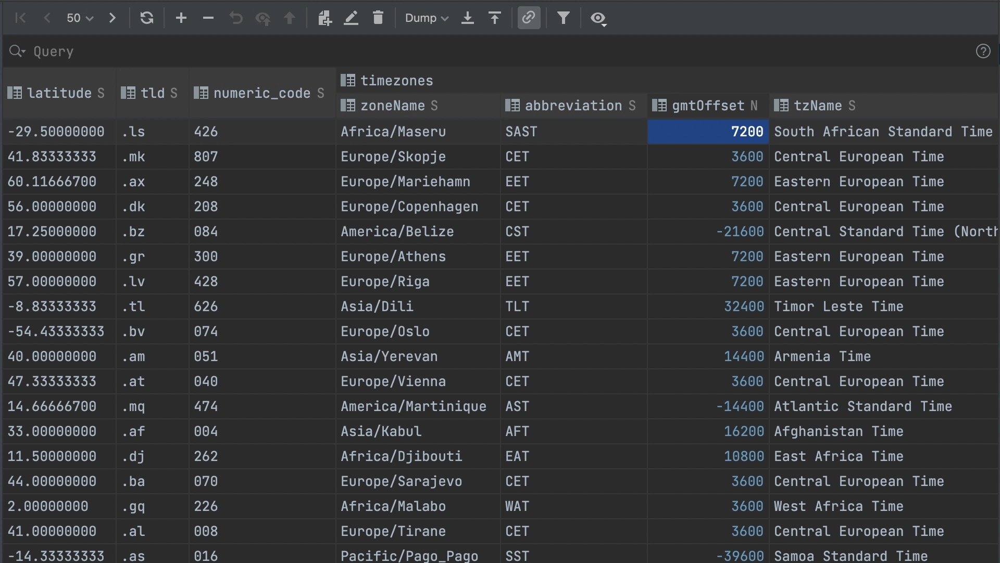
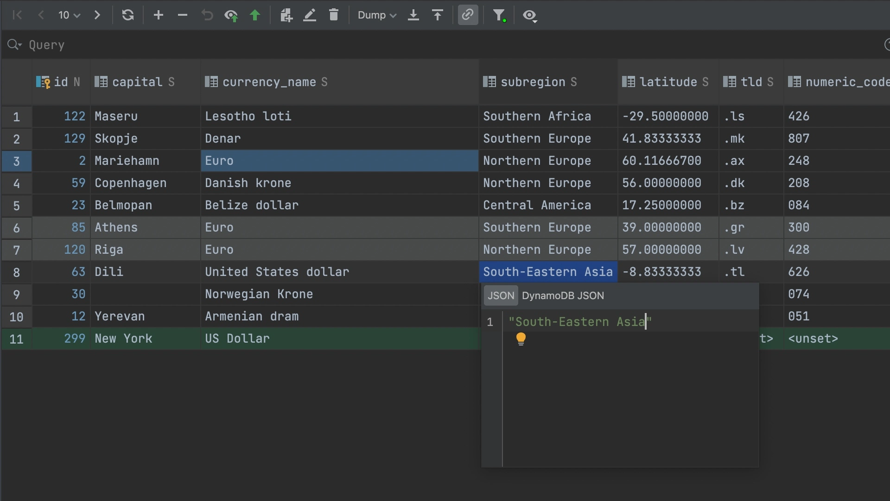
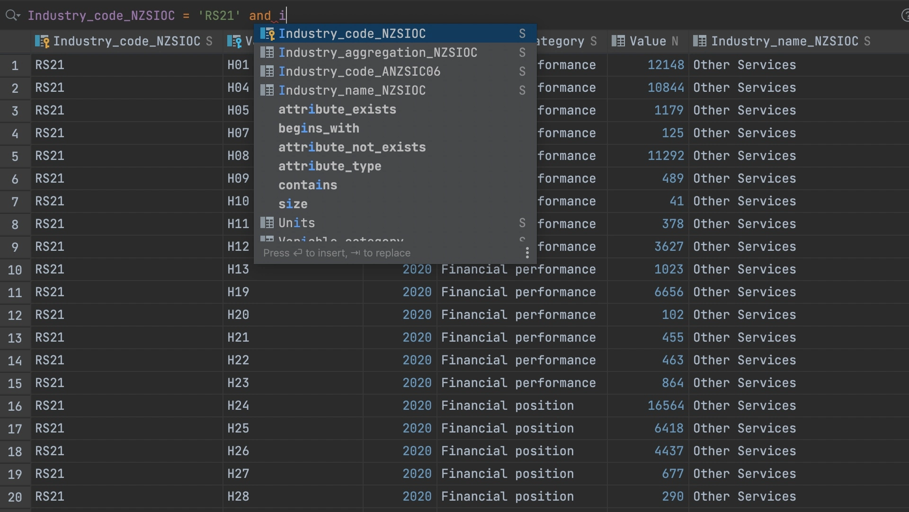
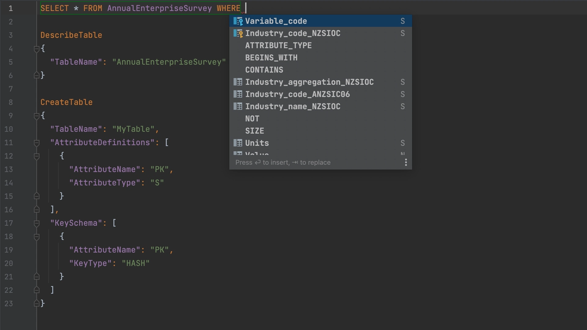

# IntelliJ DynamoDB Plugin for Jetbrains IDEs

[IntelliJ DynamoDB](https://www.intellij-dynamodb.com/) plugin is a GUI Client for DynamoDB based on IntelliJ Platform.
It is designed to query and manage DynamoDB database.
You can connect to local or cloud DynamoDB, manage it, browse and edit your data.

To get the IntelliJ DynamoDB plugin visit [Jetbrains Marketplace](https://plugins.jetbrains.com/plugin/18896-dynamodb).

To get a quick tour of basic IntelliJ DynamoDB features, see the [introduction video](https://youtu.be/E1KLrgyA83w) (2 minutes).

